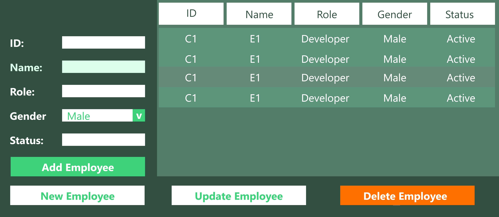

# mini_project

mini projet de python

## Employee Management System



> A simple employee management system built with Python and SQLite.

## Features

- GUI Interactions
- Add , views , Update, Delete Employee
- ...

## How to run

1. Clone the repository
   ```bash
   git clone https://github.com/twinpencil/mini_project.git
   ```
2. Navigate to the project directory
   ```bash
   cd mini_project
   ```
3. Run :
   ```bash
   python main.py
   ```

## Technologies used

   <div style="display : flex ; justify-content : center ; column-gap: 40px ;">
    
    
   </div>
